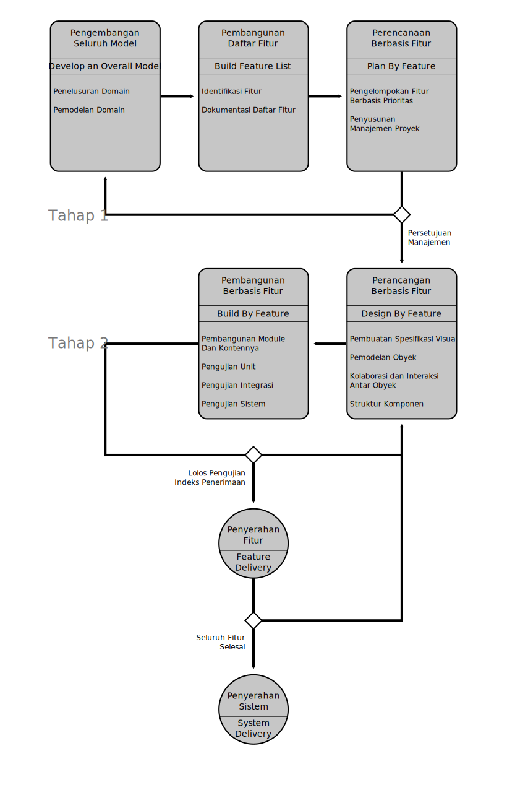

Semua langkah-langkah praktik Rekayasa Aplikasi Sistem dengan metodologi _Feature Driven Development_ adalah kumpulan pekerjaan-pekerjaan _iterative_ dan _incremental_[3] yang digambarkan oleh diagram berikut ini:

    
     Gambar 3.1: Proses[1]

**1. Develop an Overall Model**

Dalam proses pertama ini, FDD mendorong gugus tugas untuk membangun _domain model_. Berbeda dari metodologi _Agile_ yang lain, _FDD modeling_ adalah kegiatan lintas fungsional, iteratif & kolaboratif. Anggota gugus tugas (_Development Manager_, _Domain Experts_, _Chief Architec_ dan _Chief Programmer_) bekerja bersama untuk menyusun _domain model_ dengan dipandu oleh _Chief Architect_[2].

Untuk proyek dengan skala menengah ke atas, demi mendapatkan pemahaman yang kuat tentang proyek serta komunikasi yang solid, biasanya gugus tugas dibagi atas gugus-gugus tugas kecil. Idenya, setiap gugus tugas harus dapat mengusulkan _domain area model_ yang berbeda. Kemudian, setelah ditinjau, dapat dipilih opsi terbaik atau dengan menggabungkannya. Akhirnya, semua _domain area model_ akan digabungkan ke dalam _overal model_. Sebuah cara yang bagus untuk memulai proyek karena memungkinkan gugus tugas untuk mendapatkan pemahaman yang kuat tentang proyek serta komunikasi yang solid[2].

**2. Build a Feature List**

Setelah _Domain Model_ lengkap dan dinyatakan selesai, maka berdasarkan _model_ tersebut harus dapat diidentifikasi fitur-fitur yang berharga bagi klien. Fitur-fitur yang akan menjadi pedoman pengerjaan proyek. Fitur harus bisa diselesaikan dalam waktu maksimal dua minggu. Jika diprediksi akan memakan waktu lebih, harus dipecah menjadi beberapa fitur[2]. 

Sebuah fitur adalah fungsi kecil, bernilai bagi klien dan diekspresikan dalam bentuk **`<action> <result> <object>`**. Misalnya, "Hitung total penjualan", "Validasikan kata sandi pengguna", dan "Otorisasi transaksi penjualan pelanggan"[3].

Sesuai dengan namanya, fitur adalah aspek penting dari FDD. _Feature_ kedudukannya sama dengan _use case_ untuk _Rasional Unified Process_ (_RUP_) atau _user stories_ untuk Scrum. Ketiganya adalah sumber utama _requirement_ dan input utama perencanaan[4].

**3. Plan by Feature**

Adalah tentang perencanaan urutan implementasi pengembangan fitur. Tentang pengorganisasian. Sebuah _feature sets_ kemudian diserah-tugaskan kepada programmer. Saat merencanakan, harus mempertimbangkan dengan jelas berbagai aspek seperti risiko, dependensi kompleksitas, beban kerja gugus tugas, dan sebagainya[2].

**4. Design by Feature**

_Design package_ dibuat untuk setiap fitur. _Chief Programmer_ memilih sekelompok kecil fitur yang akan dikembangkan dalam waktu dua minggu. Bersama-sama dengan kandidat _Class Owner_ yang sesuai, _Chief Programmer_ bekerja dengan _activity diagram_ dan/atau _sequence diagram_ rinci untuk setiap fitur sehingga menjadi merubah _domain model_ menjadi _object model_. Selanjutnya, cetak-biru hasil design kemudian diberikan kepada kandidat _Class _Owner_ untuk diimplementasikan kedalam _code_. _Chief Programmer_ akan selalu menginspeksi implementasi yang dilakukan oleh _Class Owner_[3].

**5. Build by Feature**

_Class Owner_ harus mengimplementasikan semua _features_ yang menjadi tanggung-jawabnya dan menghasilkan _code_ yang kokoh dan bekerja dengan efisien dan efektif. Dan yang paling penting siap dintegrasikan dengan keseluruhan sistem, sesuai desain. Setelah diuji dengan _unit testing_ dan disetujui oleh _Chief Programmer_, _Features_ dapat diintegrasikan dengan fitur-fitur lainnya[2] [3].

Sumber:

1. 19-IJMECS-V9-N9-6.pdf - 
    http://www.mecs-press.org/ijmecs/ijmecs-v9-n9/IJMECS-V9-N9-6.pdf
    (halaman 1, alinea 1-3)

2. 64-Feature Driven Development (FDD) Processes
    and Comparison To Other Agile Methodologies - Hiring Headquarters.pdf - 
    https://www.upwork.com/hiring/for-clients/agile-methodologies/
    (halaman 2-3, alinea 2-5)

3. 48-Feature-driven development - Wikipedia.pdf - 
    https://en.wikipedia.org/wiki/Feature-driven_development
    (halaman 1-2, alinea 5-10)

4. 60-Feature Driven Development (FDD) and Agile Modeling.pdf - 
    http://agilemodeling.com/essays/fdd.htm
    (halaman 1, alinea 1-2)
