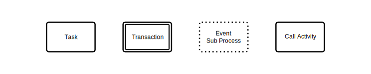
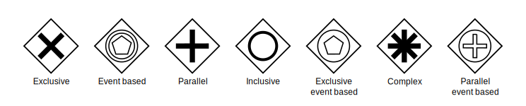
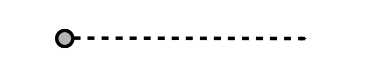
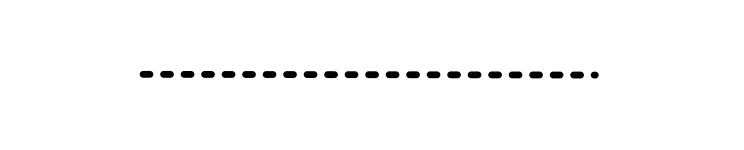
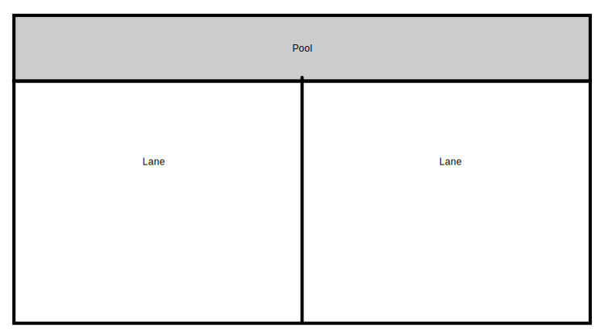
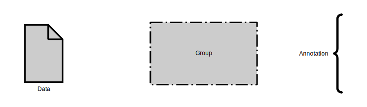

BPMN menggambarkan 4 tipe elemen untuk business process diagrams:

1. Flow objects: events, activities, gateways
2. Connecting objects: sequence flow, message flow, association
3. Swimlanes: pool atau lane
4. Artifacts: data object, group, annotation

berikut adalah elemen individual dan bagaimana penggunaannya dalam mendefinisikan sebuah business process.

Events

Pemicu yang memulai, memodifikasi atau menyelesaikan proses. Jenis events meliputi pesan-message, pewaktu-timer, kesalahan-error, kompensasi-compensation, sinyal-signal, batal-cancel, eskalasi-eskalasi, tautan-link, dan lainnya. Mereka ditampilkan oleh lingkaran yang mengandung simbol lain berdasarkan jenis events. Diklasifikasikan sebagai "throwing" atau "catching", tergantung pada fungsinya.

    
     Gambar 3.2. Events

Activities

Kegiatan atau tugas (task) tertentu yang dilakukan oleh seseorang atau sistem. Disimbolkan dengan persegi panjang dengan sudut bulat. Dapat menjadi lebih terperinci dengan sub-proses (sub-procesess), pengulangan (loops), kompensasi (compensations) dan banyak perwujudan (multiple instances).

    
     Gambar 3.3. Activities

Gateway

Titik keputusan (decision point) yang dapat menyesuaikan jalur berdasarkan condition atau event. Ditampilkan sebagai berlian (diamond). Dapat bersifat exclusive atau inclusive, parallel, complex, atau berdasarkan data atau event.

    
     Gambar 3.4. Activities

Sequence flow

Menunjukkan urutan kegiatan yang akan dilakukan. Ditampilkan sebagai garis lurus dengan panah. Bisa menunjukkan aliran bersyarat (conditional), atau default.

    
     Gambar 3.5. Sequence flow

Message flow

Menggambarkan pesan yang mengalir melintasi "pools," atau batas organisasi seperti departemen, dan actors. Tidak menghubungkan events atau activities di dalam pool. Dilambangkan oleh garis putus-putus dengan lingkaran di awal dan panah di akhir garis.

    
     Gambar 3.6. Message flow

Association

Ditampilkan dengan garis putus-putus, mengaitkan artifact atau teks ke events, activities, atau gateways.

    
     Gambar 3.7. Association

Pool dan swimlanes

Pool mewakili subyek utama dalam suatu proses. Dalam sebuah proses bisnis, pool dapat dibuat berbeda-beda walau masih terlibat dalam satu proses bisnis tersebut. Swimlanes di dalam pool menunjukkan aktivitas dan aliran untuk subyek tertentu, menunjukkan siapa yang bertanggung jawab atas bagian dari suatu proses.

    
     Gambar 3.8. Pool dan swimlanes

Artifact

Informasi tambahan yang ditambahkan developers untuk membawa ke tingkat detail yang diperlukan ke dalam diagram. Ada tiga jenis artefak: data object, group, atau annotation. Data object menunjukkan data apa yang diperlukan untuk suatu kegiatan. Group menunjukkan pengelompokan kegiatan logik tetapi tidak mengubah aliran diagram. Annotation memberikan penjelasan lebih lanjut ke sebuah bagian diagram.

    
     Gambar 3.9. Artifacts

Siapa yang melakukan pemodelan proses bisnis?

Business Process Modeling dapat terdiri dari diagram sederhana yang digambar tangan hingga yang lebih melibatkan elemen-elemen yang dapat diperluas untuk memberikan detail implementasi yang lebih memadai. Pada tingkat yang paling canggih, BPMN dilakukan oleh analis yang dipercaya. Object Management Group (OMG) menyediakan lima sertifikasi di BPMN 2.0 yang disebut OMG-Certified Expert di BPM 2.0. Satu track yang berorientasi ke bisnis, dan yang lainnya lebih ke teknis. OMG bermaksud membakukan BPMN 2.0 untuk Business Process Modeling dengan cara yang sama seperti pemodelan perangkat lunak standar Unified Modeling Language (UML).

BPMN membutuhkan komitmen waktu dan energi, tetapi imbalannya dalam pemahaman dan peningkatannya bisa menjadi sangat besar. Versi 2.0 dibangun di atas versi sebelumnya dengan menyediakan serangkaian simbol dan notasi standar yang lebih kaya, memungkinkan lebih banyak detail bagi mereka yang membutuhkannya.

Gagasan di balik Business Process Management adalah menciptakan siklus hidup perbaikan yang berkelanjutan. Langkah-langkahnya adalah memodelkan, mengimplementasikan, menjalankan, memantau, dan mengoptimalkan. Diagram BPMN memainkan peran kunci dalam hal itu.

Sub-models di dalam diagram BPMN

Diagram BPMN digunakan untuk berkomunikasi dengan audiens yang beragam, baik non-teknis maupun teknis. Sub-model memungkinkan beragamnya peninjau yang dengan mudah dapat membedakan bagian-bagian diagram, menemukan apa yang paling applicable untuk mereka. Jenis-jenis sub-model adalah:

- Private business processes. Untuk pihak internal organisasi tertentu dan tidak lintas pools, atau batas-batas organisasi.

- Abstract business processes. Berada di antara proses private business processes dan subek atau business process lain. Abstract business processes menunjukkan kepada dunia luar urutan pesan yang diperlukan untuk berinteraksi dengan private business processes. Tidak menunjukkan private business processes itu sendiri.

- Collaboration business processes. Menunjukkan interaksi antara dua atau lebih entitas bisnis.

Tipe diagram lain 

Diagram digunakan untuk berkomunikasi dengan audiens yang beragam, baik non-teknis dan teknis. Sub-model memungkinkan audiens yang beragam untuk dengan mudah membedakan antara bagian-bagian diagram, menemukan apa yang paling tepat untuk dirinya. Jenis-jenis sub-model:

- Choreography diagram: Menunjukkan interaksi antara dua atau lebih subyek. Juga dapat diperluas dengan sub-choreographies.

- Collaboration diagram: Menunjukkan interaksi antara dua proses atau lebih, menggunakan lebih dari satu pool. Semua kombinasi pools, proses, dan choreography dapat digunakan dalam collaboration diagram.

- Conversation diagram: Secara umum, adalah versi sederhana dari collaboration diagram. Menunjukkan sebuah group pertukaran pesan terkait dalam proses bisnis. Dapat diperluas dengan sub-conversations.

Kiat kunci untuk pemodelan proses bisnis

1. Tentukan dengan jelas ruang lingkup proses dengan start dan end.
2. Pertama-tama memetakan proses bisnis saat ini untuk menyoroti inefisiensi sebelum memodelkan cara yang lebih baik dengan BPMN.
3. Arahkan diagram BPMN yang sesuai pada satu halaman, meskipun halamannya menjadi seukuran poster.
4. Mengalir secara horizontal. Kecuali kondisinya memaksa, tampilkan asosiasi dan aliran data secara vertikal.
5. Dapat membuat versi diagram yang berbeda untuk stakeholder yang berbeda, tergantung pada tingkat detail yang diperlukan pada peran mereka.
6. BPMN tidak sesuai untuk memodelkan struktur organisasi, menjabarkan fungsi, atau memodelkan aliran data. Meskipun BPMN menggambarkan beberapa aliran informasi dalam proses bisnis, tetap bukan merupakan Data Flow Diagram (DFD.)

Sumber: 
    
1. 96-What is Business Process Modeling Notation  Lucidchart.pdf

    https://www.lucidchart.com/pages/bpmn#section5
    Halaman 1 - selesai
    Tanggal Akses: Senin 30 Desember 2019