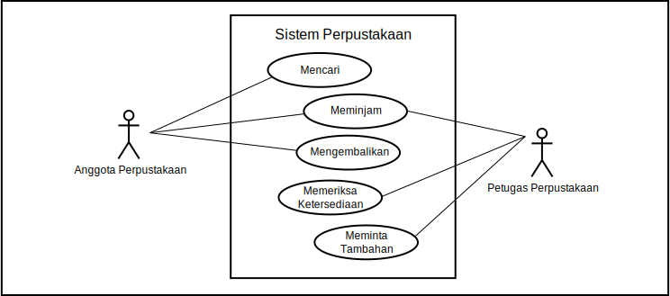
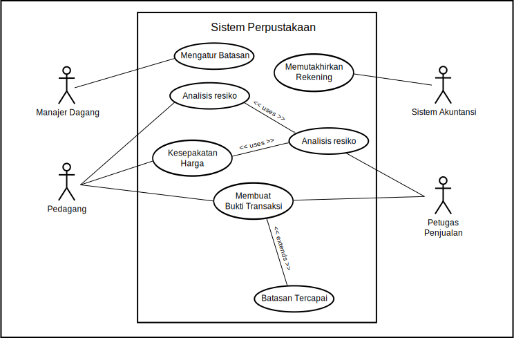

Cara ampuh agar penerbitan _actors_ dan _cases_ menjadi akurat adalah menetapkan _primary actors_ dan _goals_ mereka.  _Use cases_ yang pertama mereka aktifkan. Dengan cara ini diagram menajdi mudah dibentuk.

| Actors | Goals |
|---|---|
| Anggota Perpustakaan | mencari sebuah buku |
| Anggota Perpustakaan | meminjam buku |
| Anggota Perpustakaan | mengembalikan buku |
| Petugas Perpustakaan | mencari sebuah buku |
| Petugas Perpustakaan | memeriksa ketersediaan buku |
| Petugas Perpustakaan | meminta tambahan buku |

    
     Gambar 3.12: Use case diagram sederhana

Contoh yang lebih kompleks:

    
     Gambar 3.13: Use case diagram kompleks

