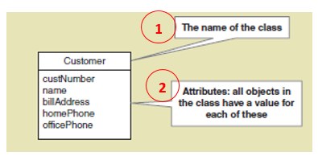
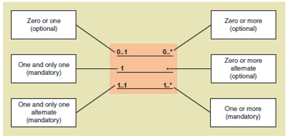
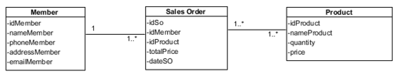
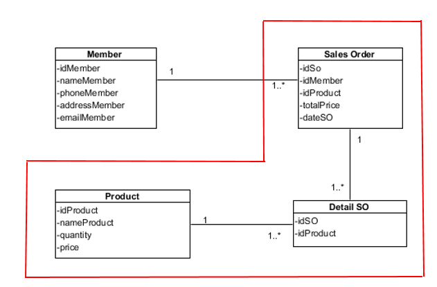
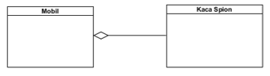
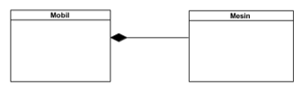
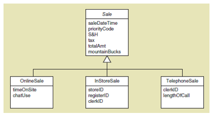

# Domain Class Diagram

Class Diagram? Apakah itu?

Class diagram merupakan salah satu diagram utama dari UML untuk menggambarkan class atau blueprint object pada sebuah sistem. Analisis pembentukan class diagram merupakan aktivitas inti yang sangat mempengaruhi arsitektur piranti lunak yang dirancang hingga ke tahap pengkodean.

Domain Modelling? Apakah itu?

Domain Modelling merupakan teknik pengidentifikasian object-object pada kata benda yang terdapat pada daftar requirement yang diklasifikasikan pada area (domain) permasalahan yang sama untuk dijadikan candidate class pada class diagram.

Notasi Class Diagram

     
    Figure: class-diagram-notation.png

## Hubungan Antar Class

Pada class diagram juga digambarkan bagaimana interaksi hubungan antar class dalam sebuah konstruksi piranti lunak seperti hubungan asosiasi, agregasi, komposisi, dan inheritance dan generalization

1. Asosiasi

Asosiasi, yaitu hubungan statis antar class. Umumnya menggambarkan class yang memiliki atribut berupa class lain, atau class yang harus mengetahui eksistensi class lain. Panah navigability menunjukkan arah query antar class.

     
    Figure: association.png

Contoh:

     
    Figure: association-example.png

Contoh diatas menunjukan domain model class yang simple dimana terdapat 3 class: Member, Sales Order, dan Product. Kita bisa lihat Member class dapat mempunyai minimal 1 dan maksimal banyak Sales Order class. Dan setiap Sales Order class dapat mempunyai minimal 1 dan maksimal 1 Member class. Sales Order class dapat mempunyai minimal 1 dan maksimal banyak Product class. Sedangkan Product class dapat mempunyai minimal 1 dan maksimal banyak Sales Order class.

Jika kita menemukan hubungan antar class seperti Sales Order dengan Product, yang disebut sebagai many-to-many asosiasi. Maka kita harus membuat Detail Class, seperti:

     
    Figure: detail-class.png

Mengapa harus dibuat Detail Class? Agara tidak terjadi redundansi data seperti halnya pada relasi antar tabel yang yidak normal.

2. Agregasi

Agregasi, yaitu hubungan antar class yang menyatakan hubungan “has-a.”

Contohnya: Mobil dengan kaca spion.

     
    Figure: agregation.png

Bila kita memodelkan sebuah mobil, maka dapat dikatakan bahwa mobil mempunyai kaca spion. Secara logis dapat dikatakan sebuah mobil dapat berfungsi walaupun tanpa kaca spion. Mobil dapat dipisahkan dari kaca spion

3. Komposisi

Komposisi, yaitu hubungan antar class yang menyatakan hubungan “part-of.”

Contohnya: Mobil dengan mesin

     
    Figure: composition.png

Bila kita memodelkan sebuah mobil, maka dapat dikatakan bahwa mesin adalah bagian dari mobil. Secara logis dapat dikatakan bahwa mobil tidak dapat dipisahkan dari mesin. Bila mesin tidak ada disebuah mobil maka mobil itu tidak berfungsi sebagai mobil.

4. Inheritance dan Generalization

Inheritance adalah hubungan hirarkis antar class. Class dapat diturunkan dari class lain dan mewarisi semua atribut dan metoda class asalnya dan menambahkan fungsionalitas baru, sehingga ia disebut anak dari class yang diwarisinya. Kebalikan dari pewarisan adalah generalisasi.

     
    Figure: inheritance-and-generalization.png

References
John W. Satzinger, R. B. (2012). Systems Analysis and Design in a Changing World. Joe Sabatino.